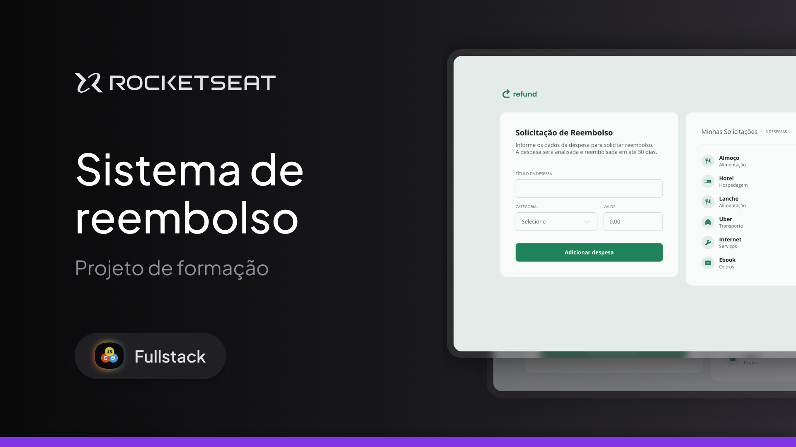

  

<h1 align="center"> Sistema de Reembolso </h1>

Programa exclusivo no curso Full-Stack, promovido pela Rocketseat para ensino de tecnologias WEB, no Modulo Intermediário JavaScript, realizado junto com intrutor, foi aplicado o Conceito JavaScript nesse projeto.

  <a href="#-tecnologias">Tecnologias</a>&nbsp;&nbsp;&nbsp;|&nbsp;&nbsp;&nbsp;
  <a href="#-Projeto">Projeto</a>&nbsp;&nbsp;&nbsp;|&nbsp;&nbsp;&nbsp;
  <a href="#-layout">Layout</a>&nbsp;&nbsp;&nbsp;

 

  

## 🚀 Tecnologias

Esse projeto foi desenvolvido com as seguintes tecnologias:

- HTML e CSS
- Git e Github
- Figma
- JavaScript

## 💻 Projeto

Voce pode visualizar o projeto pronto projeto através [DESSE LINK]()
O Projeto Sistema de Reembolso é um agregador de ensino na Rocketseat para avançar o conhecimento em JavaScript. Nesse modulo foi aplicado o conceito de Function, Classes etc.

## 🔖 Layout

Você pode visualizar o layout do projeto através [DESSE LINK](https://www.figma.com/community/file/1360316109107378379). É necessário ter conta no [Figma](https://figma.com) para acessá-lo.

---

Rocketseat: [Participe da nossa comunidade!](https://www.rocketseat.com.br/)
